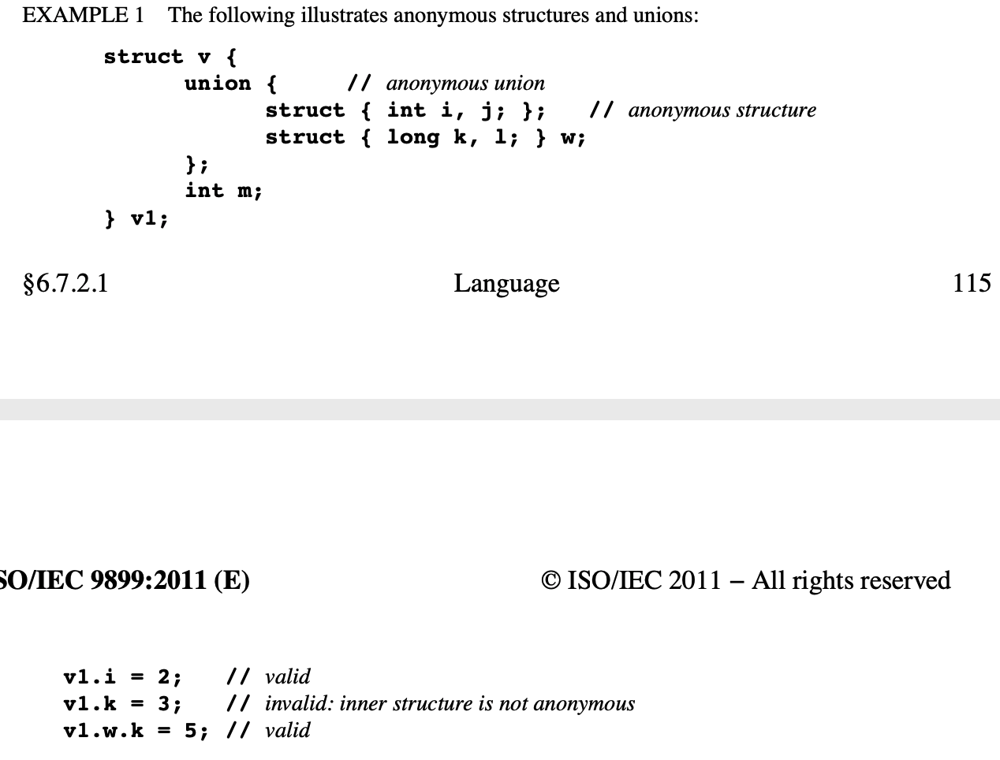

# C 语言

C 程序可以不一次都编译。源文件通过 `#include` 链接在一起编译。

启动函数是 `main`，它应当如此声明:

```c
// 返回值 int 类型，空参数
int main(void){/* ... */}
```

或者如此声明：

```c
// 返回值 int 类型，2 个参数，1 个 int 类型的整数，1 个 char 类型的数组
int main(int argc, char *argv[]){/* ... */}

/* argc 应为非负整数
 * argv[argc] 应为空指针
 * argv[argc - 1] 包含了运行环境提供的一些信息，它们是小写的字符
 * argv[0] 是程序名，如果从环境中得不到程序名，那么 argv[0][0] 是空字符。argv[1] 及以后的表示从外部传入的参数。
 * argc 与 argv 应当可被修改，从程序开始一直维持到程序结束。
 * char *argv[] 可用 char ** argv 来代替。
 */
```

下面字符在 C 语言中是等效的：

??字符 | 等效字符
---------|---------
??= | #
??( | [
??/ | \
??) | ]
??' | ^
??< | {
??! | |
??> | }
??- | ~

##### Example 1

```c
??=define arraycheck(a, b) a??(b??) ??!??! b??(a??)

相当于

#define arraycheck(a, b) a[b] || b[a]
```

##### Example 2

```c
printf("Eh???/n");

相当于

printf("Eh?\n");
```

### 编译限制

- 代码块最多嵌套 127 层
- 条件最多嵌套 63 层
- 函数最多定义 127 个参数
- 宏定义最多定义 127 个参数
- 一行源码最多有 4095 个字符
- #include 最多嵌套 15 层
- switch 最多有 1023 个 case
- struct 或 union 中最多有 1023 个成员
- enum 中最多有 1023 个枚举值
- struct 或 union 最多嵌套定义 63 层

### 数值限制

限制定义在头文件 <limit.h> <float.h>，<stdint.h>中。

原型 | value | c 类型
---------|---------|---------
CHAR_BIT | 8 | byte
SCHAR_MIN | -127 [-(2^7-1)] | signed char
SCHAR_MAX | +127 [2^7−1] | signed char
UCHAR_MAX | 255 [2^8-1] | unsigned char
SHRT_MIN | -32767 [-(2^15-1)]| short int
SHRT_MAX | 32767 [2^15-1] | short int
USHRT_MAX | 65535 [2^16-1] | unsigned short int
USHRT_MAX | 65535 [2^16-1] | unsigned short int
INT_MIN | -32767[-(2^15-1)] | int
INT_MAX | 32767[2^15-1] | int
UINT_MAX | 65535[2^16-1] | unsigned int
LONG_MIN | -2147483647 [-(2^31-1)] | long int
LONG_MAX | 2147483647 [2^31-1] | long int
ULONG_MAX | 4294967295 [2^32-1] | unsigned long int
LLONG_MIN | -9223372036854775807 [-(2^63-1)] | long long int
LLONG_MAX | 9223372036854775807 [2^63-1] | long long int
ULLONG_MAX | 18446744073709551615 [2^64-1] | unsigned long long int

### 浮点数的数学模型


### 关键字


### \_\_func\_\_


结果是: myfunc

### 匿名 Struct、Union 的访问性



### 标准头文件


### \#define \#undef

使用 #define 定义宏，#undef 移除宏定义


